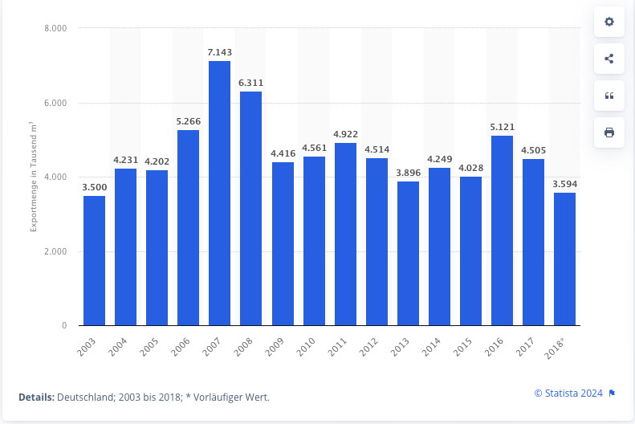
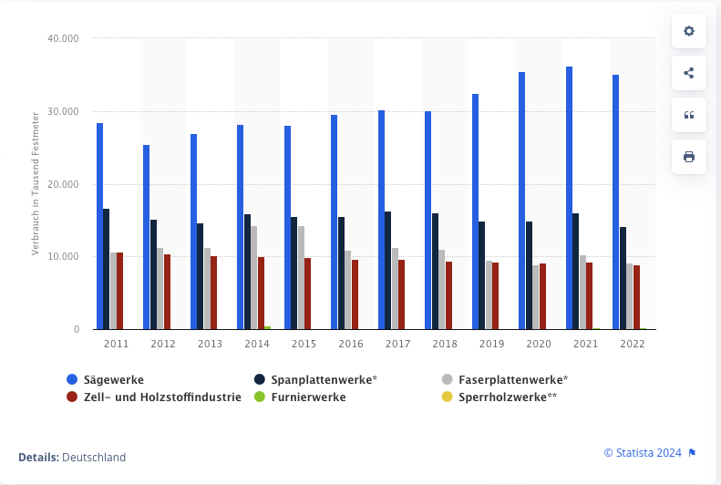
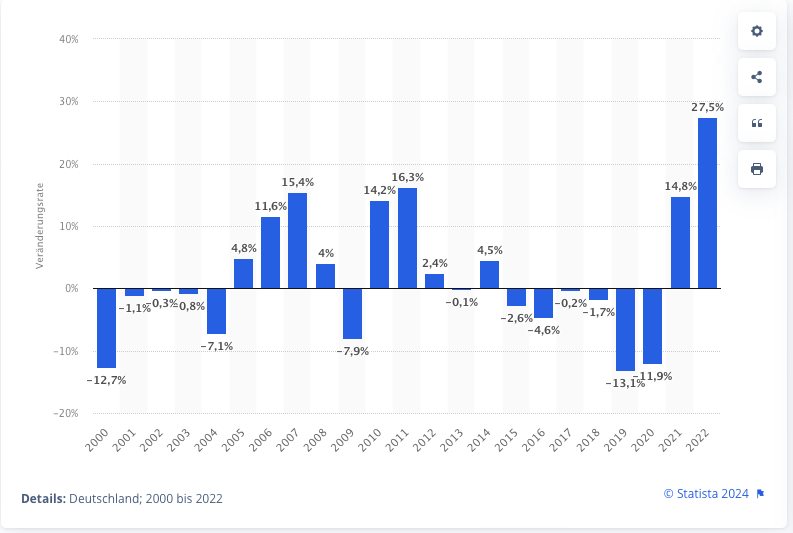
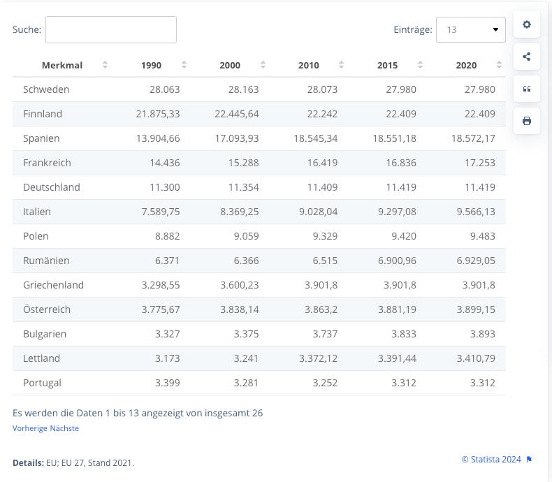

# Übersicht Industrielles Restholz #

Export von Restholz aus Deutschland in den Jahren 2003 - 2018:
https://de.statista.com/statistik/daten/studie/162616/umfrage/holzwirtschaft-ausfuhr-von-restholz-seit-2003/

Stand 2018: 3.6 Millionen Kubikmeter Restholz. Das entspricht ca. 2.16 Millionen t Restholz.

Eine Clinx 150 Anlage verbraucht ca. 3,346 t Holz pro Jahr. Demnach entspricht die exportierte Restholzmenge etwa 150 Clinx 150 Anlagen.

Neben dem Export wurden 2018 7.1 Millionen Kubikmeter Restholz importiert, also fast die dreifache Menge.
https://de.statista.com/statistik/daten/studie/162622/umfrage/holzwirtschaft-einfuhr-von-rohholz-seit-2003/

Restholzverbrauch der wichtigsten Abnehmer in Deutschland bis 2022
https://de.statista.com/statistik/daten/studie/38052/umfrage/rohholzverbrauch-der-wichtigsten-abnehmer/

Furnierwerke hatten in Deutschland im Jahr 2022 einen Roh- und Restholzverbrauch von rund 214,000 Festmeter.
Zur Verbildlichung: das entspricht etwa 128,400 kg Holz pro Jahr, also nur 4% des Verbrauchs einer Clinx 150 Pyrolyse Anlage.

Preisentwicklung Rohholz aus Deutschland bis 2022
https://de.statista.com/statistik/daten/studie/255382/umfrage/preisentwicklung-fuer-rohholz-aus-deutschland/

Erzeugerpreisindex Rohholz: https://de.statista.com/statistik/daten/studie/1238693/umfrage/erzeugerpreisindex-fuer-rohholz-in-deutschland/

Waldflächen in den Ländern der EU im Vergleich der Jahre 1990 bis 2020:
https://de.statista.com/statistik/daten/studie/158370/umfrage/waldflaechen-in-laendern-der-eu/

